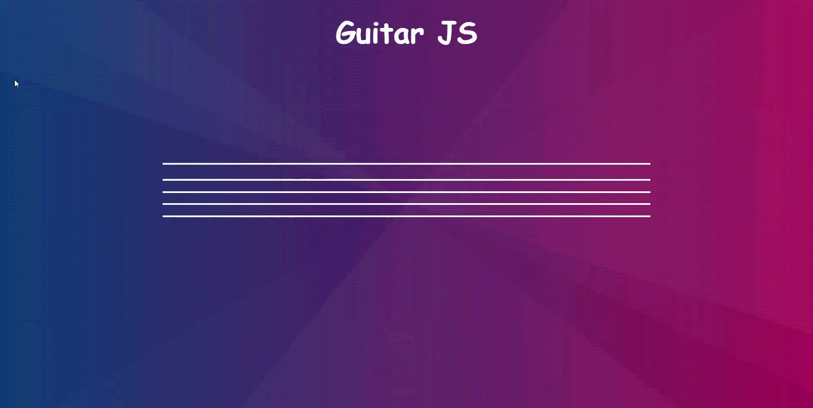

<h1 align="center">  </h1>

<h1 align="center">  </h1>

## 🚩 Sobre:

O projeto Guitar JS é uma iniciativa criada para testar meus conhecimentos sobre desenvolvimento FrontEnd.

Este é um projeto simples que consiste em uma guitarra que suas cordas podem ser tocadas.
O projeto é de nível básico e bem divertido.

---

## 💻 Tecnologias utilizadas:

- [HTML](https://developer.mozilla.org/pt-BR/docs/Web/HTML)
- [CSS](https://developer.mozilla.org/pt-BR/docs/Web/CSS)
- [JavaScript](https://developer.mozilla.org/pt-BR/docs/Web/JavaScript)

## ⚙ Funcionamento:

---

Tão simples como o projeto em si é utilizá-lo. A guitarra é dinâmica! basta clicar com o mouse na corda para ela ser tocada e emitir o som, também podemos pressionar as teclas correspondentes no teclado

<h3> Desenvolvido por Leonardo Developer FrontEnd </h3>